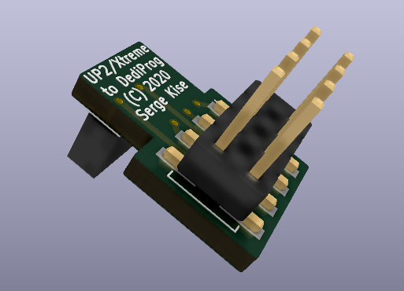
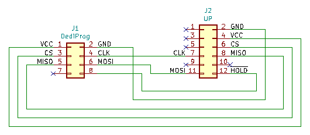

# UP2/UP Xtreme to DediProg SPI Flash Adapter

## Introduction
This is an adapter for flashing the SPI BIOS on Aaeon [UP Squared](https://up-shop.org/up-squared-series.html) and [UP Xtreme](https://up-board.org/up-xtreme/) boards using [DediProg SF100](https://www.dediprog.com/product/SF100) or [DediProg SF600](https://www.dediprog.com/product/SF600) with [ADP-SF600-TO-SF100-CB](https://www.dediprog.com/product/ADP-SF600-TO-SF100-CB) adapter

## Schematics

## Bill of Materials

[UP2/Xtreme to DediProg Adapter project on Mouser.com](https://www.mouser.com/ProjectManager/ProjectDetail.aspx?AccessID=8a40311779) - View and order all components except of the PCB.
[UP2/Xtreme to DediProg Adapter project on OSH Park](https://oshpark.com/shared_projects/vo0UxDLG) - Order PCBs.

Component type     | Reference | Description                                 | Quantity | Possible sources and notes
------------------ | --------- | ------------------------------------------- | -------- | --------------------------
PCB                |           | UP2/Xtreme to DediProg Adapter PCB          | 1        | Order from [OSH Park](https://oshpark.com/shared_projects/vo0UxDLG) or another PCB manufacturer using provided KiCad files
Connector          | J1        | 2x6 pin socket, 1.27 mm lead pitch          | 1        | Mouser [649-221321-00012T4LF](https://www.mouser.com/ProductDetail/649-221321-00012T4LF)
Connector          | J2        | 2x4 pin header, 2.54 mm lead pitch          | 1        | Mouser [571-5-146131-3](https://www.mouser.com/ProductDetail/571-5-146131-3)
